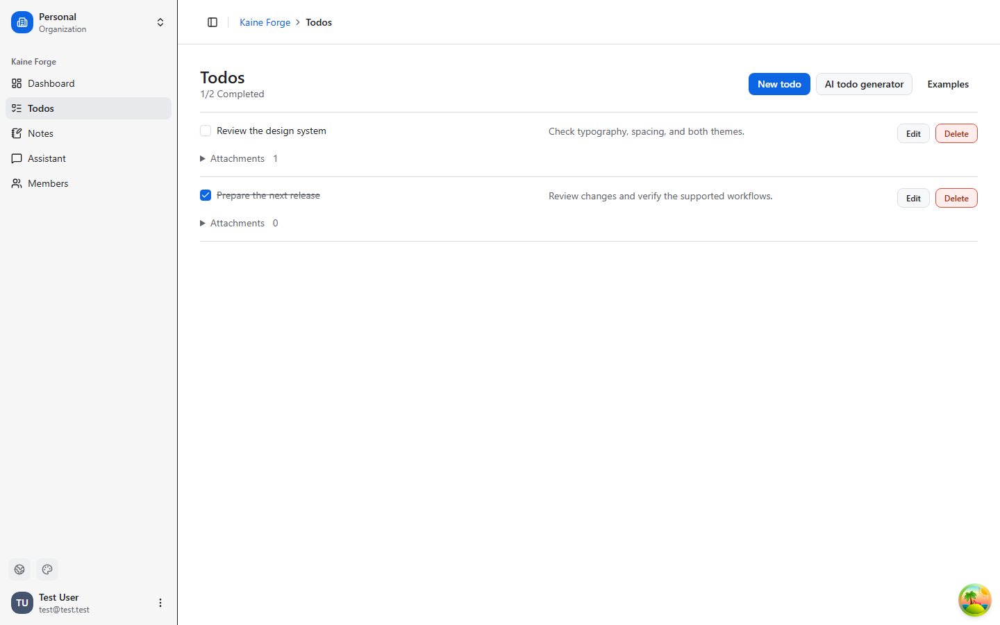
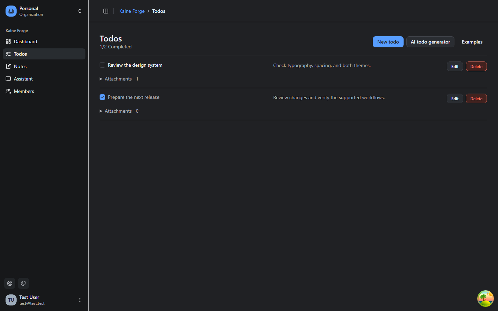
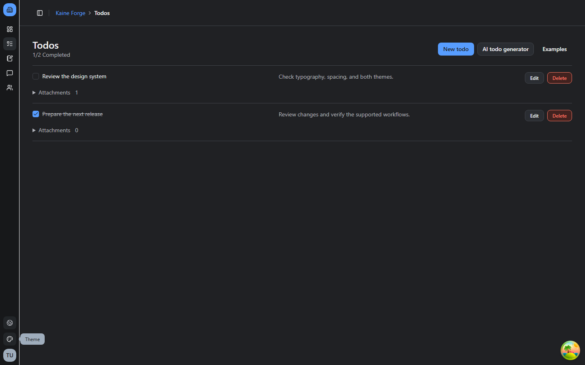
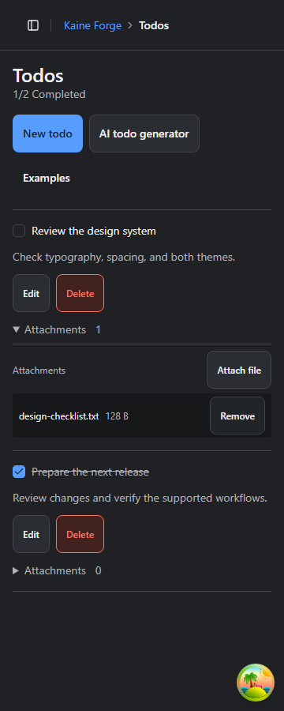

# Client redesign verification

Verified on Windows on 2026-09-11 against local PostgreSQL and MinIO.

## Coverage

| Surface               | Evidence                                                                                                                                                                                                      |
| --------------------- | ------------------------------------------------------------------------------------------------------------------------------------------------------------------------------------------------------------- |
| Authentication        | Login/signup navigation, visible labels, light/dark phone layouts, theme bootstrap and persistence tests.                                                                                                     |
| Shell and Dashboard   | Light/dark layouts at 360, 768, and 1440px; collapsed preference containment; menu keyboard access and scrolling; drawer focus restoration.                                                                   |
| Todos and Attachments | CRUD, real upload/download/removal through MinIO, compact populated rows, empty/loading/error states, retry, pending form locking, preserved failed drafts, AI dialog and both Examples forms.                |
| Notes                 | Create/edit/save, failure recovery, labeled checklist addition, completion, failed-add retry, destructive confirmation and pending deletion.                                                                  |
| Assistant             | Conversation selection/deletion, composer recovery, scroll position preservation, delayed response isolation across Organization switches. Provider responses are simulated.                                  |
| Organizations         | Switching clears route state; late Note creation cannot redirect the new scope; theme/language changes preserve drafts. Disabled feature redirects without fetching members.                                  |
| Native subset         | Component tests cover Todo scope remounts and pending form behavior. Shared buttons provide 48px primary targets; Todo forms use constrained scrolling and keyboard avoidance. Members remains a placeholder. |

Browser tests include automated contrast/accessibility checks on the reviewed routes and dialogs. These checks do not replace screen-reader testing.

## Commands

- `pnpm check:affected` — passed during implementation.
- `pnpm check` — passed, including formatting, lint, typecheck, workspace tests, boundaries, and knip.
- `pnpm coverage` — passed the repository thresholds (50.5% statements, 43.52% branches, 45.34% functions, 51.14% lines).
- `pnpm typecheck:exports:run` — passed against built package exports.
- `pnpm tokens:mobile:check` — passed; mobile tokens remain generated from the canonical source.
- `pnpm ai:doctor` — no drift; optional uvx, Firecrawl configuration, and Graphify tooling warnings remain.
- `pnpm run build:core` — passed. Vite reports the existing large-chunk warning.
- `E2E_STORAGE_ENABLED=1 pnpm test:e2e` — all 23 browser tests passed with local PostgreSQL and MinIO. This notation sets the environment variable before running the command.
- `pnpm --filter @repo/desktop build` — Windows Tauri executable rebuilt successfully.
- `pnpm --filter @repo/mobile exec expo export --platform android --platform ios --output-dir .expo/redesign-export` — both bundles exported successfully.
- `pnpm install --frozen-lockfile --ignore-scripts` and `git diff --check` — passed.

## Remaining manual checks

- Physical Android/iOS safe areas, keyboard behavior, text scaling, screen-reader announcements, reduced-motion behavior, and touch targets. Bundle exports are build checks, not device tests.
- Live AI-provider generation and streaming. No provider is configured locally; failure and delayed-response flows use browser fixtures.
- Tauri authentication was visually inspected in both themes. The remaining shared workflows were exercised in Chromium, not repeated end to end inside the desktop executable.

## Screenshots

These captures contain only the seeded test account and synthetic Todo/Attachment data. Build outputs and test traces are excluded from the PR.

| Light, 1440px                                   | Dark, 1440px                                  |
| ----------------------------------------------- | --------------------------------------------- |
|  |  |

| Collapsed sidebar                                                    | Phone browser, 360px                                           |
| -------------------------------------------------------------------- | -------------------------------------------------------------- |
|  |  |

No schema migration, backend/API change, or new production environment setting is required. The only dependency declarations added are for the existing test-only jsdom package, centralized in the pnpm catalog. No animation dependency was added.
